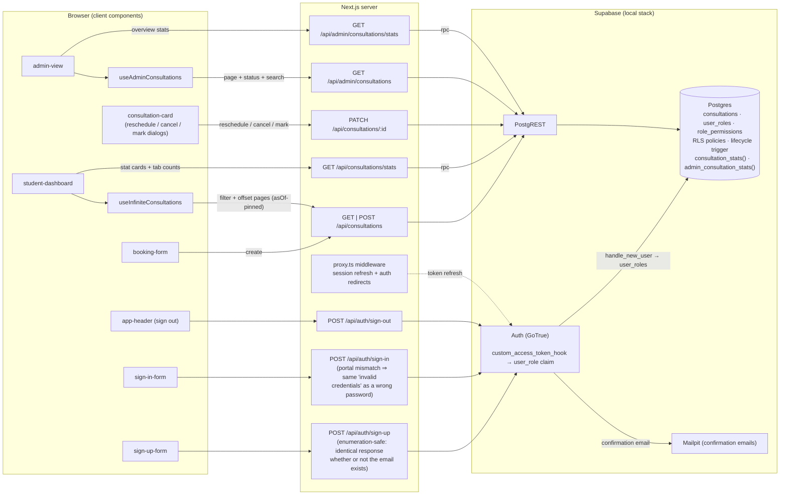

# Mini LMS V2

A consultation portal that allows students to register, book consultations, and manage them from a personalised dashboard.

## Table of Contents

- [Tech Stack](#tech-stack)
- [Getting Started](#getting-started)
- [Prerequisites](#prerequisites)
  - [Node.js Setup](#nodejs-setup)
  - [Docker Setup](#docker-setup)
  - [Supabase Setup](#supabase-setup)
- [Running the Project](#running-the-project)
  - [Using Docker](#using-docker)
  - [Without Docker](#without-docker)
- [Stopping the Project](#stopping-the-project)
- [Running Tests](#running-tests)
  - [Unit Tests](#unit-tests)
  - [E2E Tests](#e2e-tests)
- [Special Setup Notes](#special-setup-notes)
  - [Email Confirmation (Mailpit)](#email-confirmation-mailpit)
  - [Creating an Admin User](#creating-an-admin-user)
  - [After a Database Reset](#after-a-database-reset)
  - [Auth Config Changes](#auth-config-changes)
- [Summary of Overall Implementation](#summary-of-overall-implementation)
  - [Architecture](#architecture)
  - [Authentication](#authentication)
  - [Student Dashboard](#student-dashboard)
  - [Consultation Booking](#consultation-booking)
  - [Admin Portal](#admin-portal)
  - [Database Design](#database-design)
  - [Security](#security)
  - [Testing](#testing)
  - [Assumptions and Considerations](#assumptions-and-considerations)
- [Future Improvements](#future-improvements)

## Tech Stack

| Category          | Technology              | Version | Purpose                                               |
| ----------------- | ----------------------- | ------- | ----------------------------------------------------- |
| Framework         | Next.js                 | v16     | Full-stack React framework with App Router            |
| Language          | TypeScript              | v5      | Static typing across the entire codebase              |
| Database          | Supabase (PostgreSQL)   | -       | Hosted PostgreSQL with built-in Auth and RLS          |
| Supabase Client   | `@supabase/ssr`         | v0.8    | SSR-compatible Supabase client for Next.js            |
| Supabase Client   | `@supabase/supabase-js` | v2      | Core Supabase JS client                               |
| Form Management   | React Hook Form         | v7      | Performant form state management                      |
| Schema Validation | Zod                     | v4      | Runtime validation for forms and API boundaries       |
| UI Components     | Shadcn/UI + Radix UI    | -       | Accessible, unstyled primitives with Tailwind styling |
| Styling           | Tailwind CSS            | v4      | Utility-first CSS                                     |
| Date Handling     | date-fns                | v4      | Date parsing/formatting (UTC storage, local display)  |
| Unit Testing      | Vitest                  | v4      | Fast unit test runner with Jest-compatible API        |
| Coverage          | `@vitest/coverage-v8`   | v4      | V8-based code coverage                                |
| E2E Testing       | Cypress                 | v15     | End-to-end browser testing                            |
| Linting           | ESLint                  | v9      | Static analysis with Next.js config                   |

---

## Getting Started

Clone the repository:

```bash
git clone https://github.com/andylu0129/mini-lms.git
cd mini-lms
```

Install dependencies:

```bash
npm ci
```

---

## Prerequisites

### Node.js Setup

This project requires **Node.js v20**. It is recommend to use [nvm](https://github.com/nvm-sh/nvm) to manage Node versions.

1. **Install nvm**

   **macOS / Linux:**

   ```bash
   curl -o- https://raw.githubusercontent.com/nvm-sh/nvm/v0.40.1/install.sh | bash
   ```

   **Windows:**

   Download and install [nvm-windows](https://github.com/coreybutler/nvm-windows/releases) from the latest release (nvm-setup.exe can be found scrolling down to Assets section).

2. **Install and use Node.js v20**

   **macOS / Linux:**

   ```bash
   nvm install 20
   nvm use 20
   ```

   **Windows:**

   ```powershell
   nvm install 20
   nvm use 20
   ```

3. **Verify the installation**

   ```bash
   node -v
   ```

   You should see a version starting with `v20`.

### Docker Setup

1. **Install Docker Desktop and CLI**

   Download and install from the official site: [Docker Desktop](https://www.docker.com/products/docker-desktop/)

2. **Configure Docker Desktop settings** (Settings > General)

   Enable the following options:
   - **Expose daemon on tcp://localhost:2375 without TLS**
   - **Use the WSL 2 based engine** (Windows Home can only run the WSL 2 backend)
   - **Add the \*.docker.internal names to the host's /etc/hosts file** (requires password)

### Supabase Setup

> **Note:** Supabase requires Docker to be installed and running.

1. **Install the Supabase CLI**

   **Windows (via Scoop):**

   If you don't have Scoop installed, run the following in PowerShell:

   ```powershell
   Set-ExecutionPolicy -ExecutionPolicy RemoteSigned -Scope CurrentUser
   Invoke-RestMethod -Uri https://get.scoop.sh | Invoke-Expression

   # Reverts the execution policy back to its default.
   Set-ExecutionPolicy -ExecutionPolicy Undefined -Scope CurrentUser
   ```

   Then install the Supabase CLI:

   ```powershell
   scoop bucket add supabase https://github.com/supabase/scoop-bucket.git
   scoop install supabase
   ```

   **macOS / Linux (via Homebrew):**

   ```bash
   brew install supabase/tap/supabase
   ```

2. **Ensure your terminal is inside the project directory before running the following commands**

3. **Start Supabase**

   ```bash
   supabase start
   ```

4. **Reset the database** (applies migrations and seed data if exist)

   ```bash
   supabase db reset
   ```

## Running the Project

### Using Docker Container

1. **Set up environment variables**

   Run `supabase status` to retrieve your local credentials:

   ```bash
   supabase status
   ```

   The output includes an **Authentication Keys** section.
   Create a copy of `.env.example` named `.env.local` and fill in the values below.

   Example `supabase status` output:

   ```
   🔑 Authentication Keys
   ├─────────────┬────────────────────────────────────────────────┤
   │ Publishable │ sb_publishable_xxxxxxxxxxxxxxxxxxxx            │
   ```

   Your completed `.env.local` should look like:

   ```env
   NEXT_PUBLIC_SUPABASE_URL=http://host.docker.internal:54321
   NEXT_PUBLIC_SUPABASE_PUBLISHABLE_KEY=sb_publishable_xxxxxxxxxxxxxxxxxxxx
   ```

2. Build and start the container:

   ```bash
   docker compose up --build
   ```

3. Access the app at [http://localhost:3000](http://localhost:3000)

### Without Docker Container

1.  **Set up environment variables**

    Run `supabase status` to retrieve your local credentials:

    ```bash
    supabase status
    ```

    The output includes an **APIs** section and an **Authentication Keys** section.
    Create a copy of `.env.example` named `.env.local` and fill in the values below.

    | Section             | Field         | Maps to                                |
    | ------------------- | ------------- | -------------------------------------- |
    | APIs                | `Project URL` | `NEXT_PUBLIC_SUPABASE_URL`             |
    | Authentication Keys | `Publishable` | `NEXT_PUBLIC_SUPABASE_PUBLISHABLE_KEY` |

    Example `supabase status` output:

    ```
    🌐 APIs
    ├────────────────┬─────────────────────────────────────┤
    │ Project URL    │ http://127.0.0.1:54321              │

    🔑 Authentication Keys
    ├─────────────┬────────────────────────────────────────────────┤
    │ Publishable │ sb_publishable_xxxxxxxxxxxxxxxxxxxx            │
    ```

    Your completed `.env.local` should look like:

    ```env
    NEXT_PUBLIC_SUPABASE_URL=http://127.0.0.1:54321
    NEXT_PUBLIC_SUPABASE_PUBLISHABLE_KEY=sb_publishable_xxxxxxxxxxxxxxxxxxxx
    ```

2.  Build the app:

    ```bash
    npm run build
    ```

3.  Start the server:

    ```bash
    npm start
    ```

4.  Access the app at [http://localhost:3000](http://localhost:3000)

## Stopping the Project

- **Stop Supabase:**

  ```bash
  supabase stop
  ```

- **Stop the Docker container:**

  ```bash
  docker compose down
  ```

---

## Running Tests

### Unit Tests

Run all unit tests:

```bash
npm run test:unit
```

Run with coverage report:

```bash
npm run test:coverage
```

### E2E Tests

1. **Set up the Cypress environment file**

   Create a copy of `cypress.env.json.example` named `cypress.env.json` and fill in the credentials of existing users in your local Supabase instance:

   ```json
   {
     "TEST_USER_EMAIL": "your-test-user@example.com",
     "TEST_USER_PASSWORD": "YourPassword1!",
     "TEST_ADMIN_EMAIL": "your-test-admin@example.com",
     "TEST_ADMIN_PASSWORD": "YourPassword1!"
   }
   ```

   > Both users must already exist in your local Supabase instance and be email-confirmed (see [Email Confirmation (Mailpit)](#email-confirmation-mailpit)). Register them via the sign-up page, then promote the admin as described in [Creating an Admin User](#creating-an-admin-user) — the admin specs sign in through the admin portal and will fail without a genuinely promoted admin.

2. **Start the dev server**

   Cypress runs tests against the live application, so the Next.js dev server must be running first:

   ```bash
   npm run dev
   ```

3. **Open Cypress**

   In a separate terminal:

   ```bash
   npm run test:e2e
   ```

4. In the Cypress UI, select **E2E Testing** → choose a browser → click any spec file to run it.

---

## Special Setup Notes

### Email Confirmation (Mailpit)

Local sign-ups require email confirmation, but no real emails are sent. The local Supabase stack captures them in **Mailpit** at [http://127.0.0.1:54324](http://127.0.0.1:54324). After registering, open Mailpit and click the confirmation link before signing in.

### Creating an Admin User

Every sign-up is created as a **student** (a database trigger assigns the role on user creation and there is deliberately no admin sign-up path). To promote a user to admin, run this in the Supabase Studio SQL editor ([http://127.0.0.1:54323](http://127.0.0.1:54323)):

```sql
update public.user_roles
set role = 'admin'
where user_id = (select id from auth.users where email = 'your-email@example.com');
```

The role is stamped into the JWT at sign-in time by the Custom Access Token hook, so the promoted user must **sign out and sign in again** (via the Admin toggle on the sign-in page) for the new role to take effect.

### After a Database Reset

`supabase db reset` wipes all data **including `auth.users`**, but browser sessions survive it and the still-valid JWT now references a deleted user, so inserts fail with foreign-key violations. After any reset: sign out (or clear the `sb-*` cookies), register a fresh user, and confirm it via Mailpit.

### Auth Config Changes

The Custom Access Token hook and redirect URLs are configured in `supabase/config.toml`, which is baked into the containers at startup. `supabase db reset` replays SQL only, After changing `config.toml`, run `supabase stop && supabase start`.

---

## Summary of Overall Implementation

### Architecture

- **Next.js App Router** with three layers: Server Components for pages/layouts (including server-side role gates), client components for interactive UI, and **route handlers** (`src/app/api/...`) as the API layer, all auth and data operations go through them.
- **Middleware** (`src/proxy.ts` → `updateSession`) refreshes the Supabase session on every request and redirects unauthenticated users to sign-in, exempting `/api/*` and public routes.
- **Three Supabase clients**, one per execution context (browser, server, middleware), never reused across contexts, following `@supabase/ssr` guidance.
- **Conventions**: all magic strings/numbers live in `src/constants/`; shared domain types are ambient in `src/types/global.ts`; shared helpers in `src/utils/`; reusable client logic in `src/hooks/` (`useInfiniteConsultations`, `useAdminConsultations`, `useDebounce`); zod schemas in `src/lib/zod/schemas/`.

The wiring between client components, their API routes, and the Supabase stack:



Every browser → API arrow passes through the middleware first; every PostgREST → Postgres query is filtered by RLS and, for writes, the lifecycle trigger regardless of which route issued it.

### Authentication

- **Password sign-in over magic links/OTP**: students return to the portal routinely, and a remembered password signs them in immediately rather than gating every visit on an email arriving.
- **Session handling**: `@supabase/ssr` keeps tokens in HTTP-only cookies. Regardless of sign-in method, the middleware and route handlers validate requests with `getClaims()`: local JWT signature verification, no auth-server round-trip. The trade-off (a revoked-but-unexpired token still passes) is acceptable because RLS and the database triggers remain the enforcement layer: a stale token can still only act on its own rows.
- **Sign-up**: React Hook Form + zod (name, email, password complexity, confirmation). The API returns an identical success response whether or not the email already exists, preventing **account enumeration**. Email confirmation redirects back to the sign-in page.
- **Sign-in**: a single form with a student/admin portal toggle. After password verification the API reads the `user_role` claim from the JWT. Signing into the wrong portal returns the same "Invalid login credentials" message as a wrong password (no information leak), and users are redirected to their role's dashboard after successful sign-in.
- **Sign-out**: a route handler that clears auth cookies even if token revocation fails, with a `BroadcastChannel` notifying other tabs.
- **RBAC**: a `user_roles` table (one role per user, assigned by trigger at sign-up) and a `role_permissions` matrix, stamped into every JWT as a `user_role` claim by a **Custom Access Token Auth Hook**. New roles/permissions are added as enum values plus permission rows without code changes.

### Student Dashboard

- **Stats** are computed by a single grouped aggregate in the database (`consultation_stats()` RPC) rather than fetching rows to count client-side.
- **Two tabs**: _Upcoming_ (status `upcoming` and time still in the future) and _Past_ (everything else). Tab counts come from the same time-aware stats, so counts always match list contents.
- **Infinite scrolling** via a custom hook: an `IntersectionObserver` sentinel loads the next page (server-side `range` pagination), with a generation counter discarding out-of-order responses on tab switches. The two list UIs paginate differently on purpose, a personal feed scrolls naturally (and needs no page controls on mobile), whereas the admin's bulk records suit explicit pages.
- **Mutations** (reschedule, cancel, mark) refetch the list and the stat cards together. Counts are still a point-in-time snapshot: because `past` is derived from the clock, a consultation crossing its start time while the page sits open is only updated on the next fetch (live updates are listed under [Future Improvements](#future-improvements)).

### Consultation Booking

- Date and time are collected separately (shadcn Calendar + time input), combined with date-fns, and stored as **UTC**. All display is in the viewer's local timezone.
- **Name fields come from the signed-in account and are read-only.** The attendee is always the booker, so editable names would only introduce inconsistency. Each booking keeps its own copy of the name instead of joining `auth.users` at read time, leaving historical records untouched if the account is later renamed.
- **Lifecycle rules** (enforced at three layers, see [Security](#security)):
  - New bookings and reschedules must be at least **60 minutes** (`LEAD_TIME_MINUTES`) in the future, so every consultation is born with a full modification window.
  - _Upcoming_ consultations can be **rescheduled or cancelled** until 60 minutes before the start time, after which they lock.
  - Once the time has passed, a consultation becomes **past** and can be marked **complete or incomplete**.
  - Cancelled/complete/incomplete are terminal states.

### Admin Portal

- **Read-only** view of all consultations, gated three ways, a server-side role check on the page (redirects non-admins), explicit 403s in the admin API routes, and RLS as the authoritative layer.
- The records table has **page-based pagination** (exact total count from PostgREST), **server-side search** (name, email, reason) with debounced input and a clear button, a **status filter** covering all five statuses, and a manual refresh button.
- **Freshness is manual refresh rather than polled or pushed, and that is deliberate.** With hundreds of students booking and rescheduling, a table that updates itself changes constantly: the newest-first ordering means every new booking lands at the top of page 1, shifting rows under the admin mid-read and invalidating page offsets. A manual refresh keeps the table a stable snapshot the admin controls, which suits a read-only overview where no decision hinges on second-by-second freshness and any future admin action would be re-validated server-side at submit time regardless of how stale the row on screen was.
  - **Why not polling**: its load scales with the number of open tabs times polling frequency rather than with actual change, most polls return data nobody asked for, and it reintroduces the mid-read churn without solving anything the refresh button doesn't.
  - **Why not realtime**: the table is server-side paginated, filtered, and searched where a row-level change event cannot tell the client whether that row belongs on the current page under the current filter and search term, so nearly every event would trigger a full refetch anyway. Under a busy portal that degenerates into polling at the database's pace, plus a WebSocket per viewer. Realtime thrives when the client owns the working set (a personal dashboard, a chat), but paginated admin table is the wrong shape for it. If fresher data were ever needed, the cheap middle grounds come first: a "last updated x minutes ago" label, refetch on window focus, or a count-only check that shows a "new records found, please refresh." banner.
- Portal-wide stats (total consultations, upcoming, distinct students) come from a dedicated `admin_consultation_stats()` RPC.

### Database Design

- **`consultations`**: owner (`user_id` → `auth.users`), denormalised student name/email, reason, `timestamptz` datetime, status enum, `created_at`.
- **Statuses**: four are stored (`upcoming`, `complete`, `incomplete`, `cancelled`); a fifth, **`past`**, is _derived at read time_ (`status = 'upcoming' AND datetime <= now()`). Deriving instead of storing avoids a scheduled job to flip rows and is always accurate.
- **Indexes**: `(user_id, datetime)` and `(user_id, status, datetime)`: the latter serves both the grouped stats (leftmost prefix) and the status-filtered, datetime-ordered list queries.
- **Triggers**: `enforce_consultation_lifecycle` (before insert/update) enforces the lead-time and one-way status rules with the database clock; `preserve_created_at` prevents tampering with creation timestamps; `handle_new_user` assigns the default role.
- **Functions**: `authorize()` (permission check used inside RLS policies), `consultation_stats()`, `admin_consultation_stats()`: the latter two are `security invoker`, so RLS applies to whoever calls them.

### Security

- **RLS is the authoritative layer**: students can read/insert/update only their own rows, whereas admins gain read-everything through `authorize('consultations.read')`.
- **Defense in depth for business rules**: client checks decide which buttons render, API routes re-validate with the **server clock** (a user can change their local time). The database trigger is the backstop that even direct PostgREST calls (possible with the public key) cannot bypass.
- **Roles are never client-writable**: they live in `user_roles`, are stamped into the JWT server-side, and are never read from `user_metadata`.
- **Identity comes from the session, never the payload**: route handlers resolve the acting student from the verified JWT's `sub` claim. Request bodies carry consultation fields only, there is no user id a tampered request could substitute.
- **No delete path exists**: the `consultations` table has no DELETE policy at all. Cancelling is a status change, so the record of what was booked survives both client bugs and deliberate abuse.
- **No privileged credentials exist in the app at all** — the only key configured is the publishable one, so every query (browser or server, student or admin) runs under RLS. There is no service-role key to leak, and no code path that bypasses row-level security.
- **Error hygiene**: database errors are logged server-side and replaced with a generic message and schema details never reach the client. Auth flows return deliberately indistinguishable responses (enumeration prevention, portal mismatch).
- **Validation at every boundary**: zod schemas on forms (UX) and again in every route handler (enforcement), with UUID validation on path params.

### Testing

- **Unit tests** (Vitest) live under `test/`, separate from source, with V8 coverage available. `test/unit/utils/consultations.test.unit.ts` covers the domain helpers with fake timers pinning the clock: the snake_case→camelCase row mapping, the derived `past` status (including the exact-boundary case), the lead-time rules in `canModify` (allowed / boundary / locked / wrong status) and `canMark`, and the relative time labels.
- **E2E tests** (Cypress) run against the live dev server and the real local Supabase stack, no mocks, using pre-registered student and admin test users:

  | Spec                      | Coverage                                                                                                                                                                                                                                             |
  | ------------------------- | ---------------------------------------------------------------------------------------------------------------------------------------------------------------------------------------------------------------------------------------------------- |
  | `auth/sign-in.cy.ts`      | Form rendering, unauthenticated redirect, sign-up link, student/admin portal toggle, invalid credentials, successful sign-in                                                                                                                         |
  | `auth/sign-up.cy.ts`      | Form rendering, sign-in link, required-field and password-mismatch validation, success screen that displays identically for new and already-registered emails (account-enumeration check)                                                            |
  | `student-dashboard.cy.ts` | Welcome message, stat cards, upcoming/past tab switching, navigation to booking, sign-out via the account menu                                                                                                                                       |
  | `booking.cy.ts`           | Form rendering, prefilled and locked name fields, reason/date validation, cancel navigation, a full booking that redirects to the dashboard                                                                                                          |
  | `admin-view.cy.ts`        | Read-only overview, stats, search with empty state and clear button, status filter, and portal-mismatch checks in both directions (student credentials rejected on the admin portal and vice versa, with the same generic error as a wrong password) |

- **Custom commands** (`cypress/support/commands.ts`): `signInStudent` / `signInAdmin` cache their sessions via `cy.session` so each signs in once per run, and `waitForHydration` waits until React has hydrated the page before tests interact with it to prevent the situation where clicks and keystrokes dispatched against server-rendered HTML land on elements whose handlers do not exist yet.

### Assumptions and Considerations

- **Single role per user** - the `user_roles` design supports future roles (e.g. tutor) via enum extension, but each user holds exactly one role.
- **Admins are provisioned, not registered** — there is no admin sign-up; promotion is manual/seed-based (see [Creating an Admin User](#creating-an-admin-user)).
- **Marks are permanent** - complete/incomplete records how a consultation went; allowing edits would undermine the record. Only unmarked past consultations can be marked.
- **The 60-minute lead time** applies to both directions: you cannot book/reschedule into the locked window, and you cannot modify a consultation already inside it. One constant (`LEAD_TIME_MINUTES`) drives the UI copy, API checks, and (kept in sync manually) the database trigger.
- **Offset pagination with a frozen clock per scroll.** Page 2 is fetched as "skip 10 rows", which only works if the rows don't move between fetches. But the upcoming/past split depends on the current time, so if a consultation's start time passes while the user is scrolling, it silently switches sides, every row below it shifts, and one row gets skipped or shown twice. The fix: when a list loads, the client records the time once (`asOf`) and sends it with every page request, so all pages of that scroll use the same clock and rows stay put. The list picks up time changes on the next reload (tab switch, mutation, refresh). Keyset pagination is the upgrade path if data volume ever grows.
- **Stats via RPC** rather than PostgREST aggregate functions, which Supabase disables by default, a database function keeps the aggregate intentional and RLS-scoped.
- **Everything is in the `public` schema.** In Supabase, `public` does not mean the data is public, it only means the object is reachable through the API, and RLS still decides who sees which rows. The app's own table and functions have to be reachable, so they belong there; the internal RBAC pieces sit alongside them purely for simplicity, protected by RLS and grants. Moving them to a private schema is considered under [Future Improvements](#future-improvements).
- **No rate limiting on admin endpoints** — callers are authenticated admins hitting cheap indexed queries, and the refresh button already serialises requests (enforcing one request at a time). Supabase's built-in limits cover the auth endpoints.
- **UTC in the database, local time in the UI** — `timestamptz` normalises storage; date-fns formats in the viewer's timezone.
- **`getClaims()` is preferred over `getUser()` throughout** — three reasons. First, cost: `getClaims()` verifies the JWT signature locally, while `getUser()` is a round-trip to the auth server; the middleware plus every route handler would otherwise add that latency to each request. Second, necessity: the `user_role` claim that drives all authorisation exists only in the JWT, which means `getUser()` does not return custom claims, so role checks would still need to read the token. Third, the risk it accepts is already contained: what `getUser()` adds is detecting revoked-or-deleted sessions before token expiry, but a stale token here can only act within its own rows (RLS) and within the lifecycle rules (database triggers), and the exposure window is bounded by the JWT's one-hour expiry. If mutations ever bypassed RLS (e.g. a service-role client), `getUser()` would become the right call for those paths.
- **One zod schema per input, used on both sides** — the same schema drives the React Hook Form resolver (instant feedback) and the route handler check (enforcement), making it robust so that client and server validation never drift apart. The schemas also read as documentation of what each endpoint accepts.
- **All user-facing copy lives in `src/constants/`** — one source of truth for labels, errors, and status names, which keeps wording consistent and would make future internationalisation a translation task rather than a codebase-wide hunt.
- **Permanent actions require confirmation** — cancelling and marking complete/incomplete each go through a dialog, since both mutate persisted state and marks cannot be undone.
- **No deletion, by design** — consultations are a factual record of what was booked; the strongest action available is cancellation.

---

## Future Improvements

- Realtime updates (Supabase Realtime) for the student dashboard, where the client owns its small working set. For the admin table, lighter freshness cues (refetch on focus, a "new records" banner) fit better, see the rationale in [Admin Portal](#admin-portal).
- Keyset (cursor) pagination for consultation lists if data volume grows.
- Refresh admin stat cards together with the table refresh button.
- Additional roles (e.g. tutor) using the existing role/permission mechanism.
- Multi-factor authentication. Supabase ships TOTP support, so a second factor is mostly integration work.
- Application-level rate limiting on the auth endpoints (edge middleware or a gateway) on top of Supabase's built-in limits, as extra brute-force protection.
- An upper bound on how far ahead a consultation can be booked (e.g. one year), complementing the existing 60-minute minimum.
- **Move the internal objects out of the exposed schema.** The RBAC setup follows Supabase's [custom claims & RBAC guide](https://supabase.com/docs/guides/database/postgres/custom-claims-and-role-based-access-control-rbac), which defines `user_roles`, `role_permissions`, `authorize()` and the token hook in `public` and locks them down with grants (`revoke all ... from authenticated, anon, public`), so the Data API already rejects any request against them. The [hardening guide](https://supabase.com/docs/guides/database/hardening-data-api) goes a step further: expose only what clients actually call, and keep internal objects in a non-exposed schema so they are not addressable through the API at all — protection that also survives an accidental re-grant in a future migration. Here that would mean a `private` schema holding the RBAC tables/functions and the lifecycle trigger, plus explicit grants for the only two things that still use them: the auth server (the `supabase_auth_admin` role) must keep reading `user_roles` and running the token hook whenever it issues a JWT, and signed-in users (the `authenticated` role) must keep permission to run `authorize()`, because the RLS policy on `consultations` calls that function as part of their own queries. Finally, the hook URI in `supabase/config.toml` points at the schema, so it would be updated to match.
- **A write-enabled admin role (cancel/reschedule any consultation).** The admin portal is read-only today, but the permission mechanism was built to make this an additive change rather than a redesign:
  1. Add a `consultations.update` value to the `app_permission` enum (its own migration, new enum values must be committed before use) and grant it to `admin` in `role_permissions`.
  2. Add an UPDATE policy on `consultations` using `authorize('consultations.update')`, alongside the students' own-rows policy.
  3. Decide how the lifecycle trigger treats admins: default would be to keep the same rules (terminal states stay immutable, no backdating), while exempting admins from the 60-minute lock via the JWT role (`auth.jwt() ->> 'user_role'`) so staff can act inside the window students cannot.
  4. The existing `PATCH /api/consultations/[id]` route needs almost nothing. Since admins can already read any row, once RLS permits the update, the same handler serves both roles.
  5. UI: reuse the existing reschedule/cancel dialogs on admin table rows, refresh the table and stats via the hook's `reload`, and retire the "Read-only" badge.
